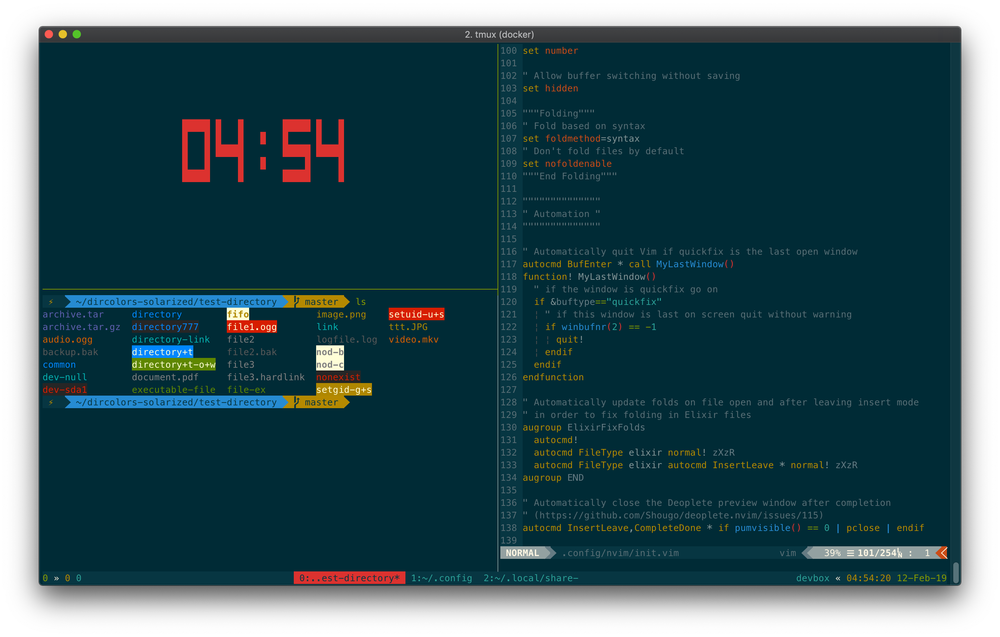

# Dotfiles [](https://travis-ci.com/jswny/dotfiles)  [](https://trello.com/b/Zgx9HvLn)
These are my personal dotfiles which I use on a daily basis on MacOS!



## Dependencies
These dotfiles depend on the following dependencies:
- [Fish Shell](https://fishshell.com/)
- [Fisher](https://github.com/jorgebucaran/fisher)
- [NeoVim](https://neovim.io/) (latest version)
- [Tmux](https://github.com/tmux/tmux) (v2.9+)
- [Tmux Plugin Manager (TPM)](https://github.com/tmux-plugins/tpm)
- [FZF](https://github.com/junegunn/fzf)
- [FD](https://github.com/sharkdp/fd)
- [Bat](https://github.com/sharkdp/bat)
- [Delta](https://github.com/dandavison/delta)
- [The Fuck](https://github.com/nvbn/thefuck)
- [GNU Coreutils](https://formulae.brew.sh/formula/coreutils) (MacOS only)

- Either [iTerm2](https://www.iterm2.com/), [Hyper Terminal](https://hyper.is/), or another terminal that can use the Solarized Dark colorscheme for all colors to work fully.

## Setup
1. Install dependencies
2. Run the setup script:
```sh
https://github.com/jswny/dotfiles.git
cd dotfiles
./scripts/setup.sh
```

## Local Configuration
### Fish
- To add local Fish configuration, simply create a file `local.config.fish` and place it in the same directory as `config.fish`. From there, `config.fish` will source that file if it exists (after it has already run all of its own commands).
- You can change your `$PATH` in Fish by either modifying it in `local.config.fish`, or by setting it one time universally via `fish_user_paths` (recommended): `set -U fish_user_paths /usr/local/bin $fish_user_paths`.

## Docker
This repository contains a `Dockerfile` which you can use to test out these dotfiles. This will build an Ubuntu-based docker image and run it for you:
`docker build -t jswny/dotfiles . && docker run -it jswny/dotfiles`
You can also pull [the latest version from Docker Hub](https://hub.docker.com/r/jswny/devbox) if you don't want to build it yourself.

## Philosophy
- Minimal configuration where possible
- Use the [XDG Base Directory Spec](https://standards.freedesktop.org/basedir-spec/basedir-spec-latest.html) where possible/reasonable
  - Accordingly, consume the existing XDG environment variable if possible or use a default set at the point of use, instead of relying on XDG variables being already set before the point of use.
  - See [this Arch Linux guide](https://wiki.archlinux.org/index.php/XDG_Base_Directory) for a good summary of which programs support XDG
- Support MacOS and Linux
  - Support Windows to some extent, but only through WSL. When WSL 2 is stable Windows support might be more feasable, but at the moment WSL 1 breaks Fish
- Fail gracefully but try to warn when something is going wrong
- Use truecolor (hex colors) when possible, fallback to 256 colors, and only then fallback to ANSI colors.

## Additional Files and Linking
Most symlinks are automatically setup in the setup script. However, non-cross-platform utilities are not, and can be handled as shown below.
- `hyper/hyper.js` -- Hyper Terminal configuration
  - `ln -s $PWD/hyper/hyper.js ~/.config/hyper/hyper.js`
- `iterm2/com.googlecode.iterm2.plist` -- iTerm2 general configuration
  - Configure iTerm2 to use this file for preferences directly (symlinks don't work)
- `iterm2/profiles.json` -- iTerm2 [Dynamic Profiles](https://www.iterm2.com/documentation-dynamic-profiles.html) configuration
  - `ln -s $PWD/iterm2 ~/Library/Application\ Support/iTerm2/DynamicProfiles/profiles.json`
